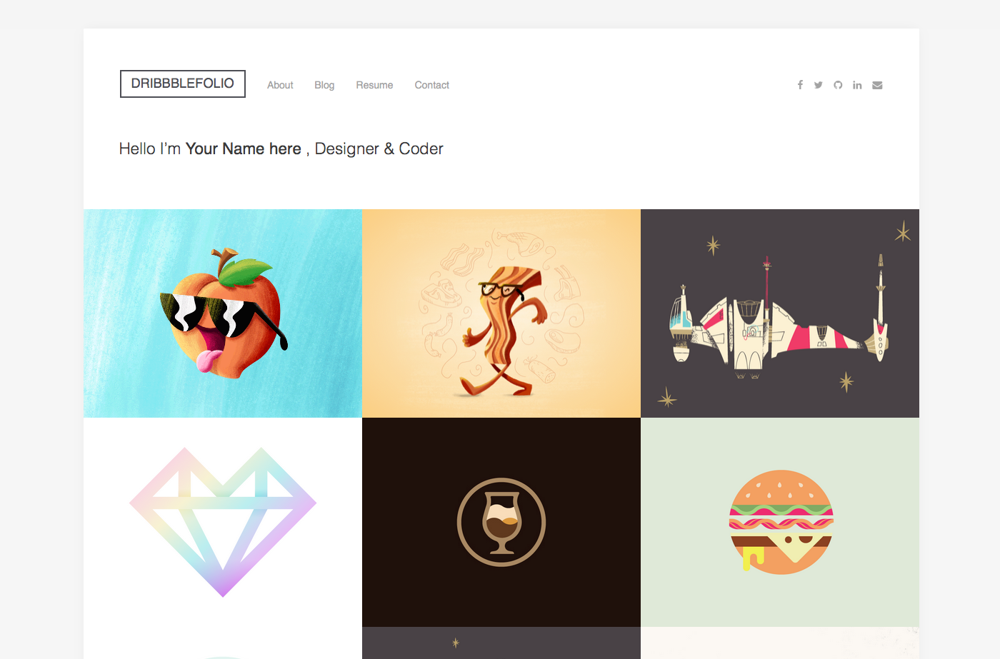

# DribbbleFolio
> Dribbble Portfolio Page developed with Vanilla JS



## Motivation
I created a [Vanilla JS](http://vanilla-js.com/) version based on the original [DribbbleFolio](https://dribbble.com/shots/2035170-DribbbleFolio-Dribbble-Portfolio-HTML-Template-Free-Download).

## How to use?
DribbbleFolio is a [Vanilla JS](http://vanilla-js.com/) plugin with no dependencies. Open the [`index.html`](index.html) file and fill javascript variable with your username:

```javascript
DribbbleFolio({
    username: 'your_dribbble_username',
    counter: 18
});
```

In file [`config.php`](config/config.php) you must populate the variable token with the Token of your app created in [Dribbble API](http://developer.dribbble.com/v1/).

## How to customize JS/CSS

Open files in assets/ and customize as you wish. Then run the following command in the terminal to make the JS/CSS minification:

```bash
$ grunt
```

## Contributing

Check [CONTRIBUTING.md](CONTRIBUTING.md) for more information.

## History

Check [Releases](https://github.com/pinceladasdaweb/DribbbleFolio/releases) for detailed changelog.

##Browser Support

 |  |  |  | 
--- | --- | --- | --- | --- |
IE 8+ ✔ | Latest ✔ | Latest ✔ | Latest ✔ | Latest ✔ |

## License

[MIT](LICENSE)